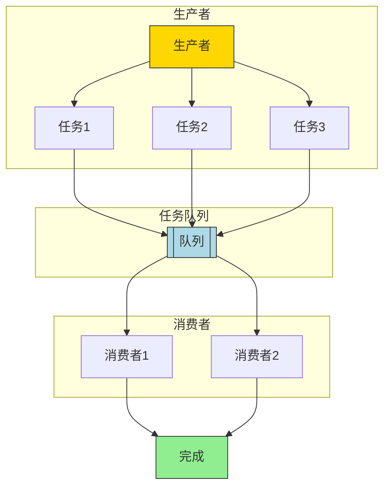

# 并发控制为什么离不开互斥

## 互斥
### 人类是 “sequential creatures”
- 人类具备 A→…→BA→…→B 简化为 A→BA→B 的直觉本能
- 人类可以把物理世界的状态机上化简抽象，只要有类似的经历就可以理解。
    - 并且据此开发了编译器 (处理器也是编译器)
    - **多处理器和并发执行推翻了顺序执行的基本假设！**
    - 人类天生不能理解并发程序
- **阻止并发的发生**
	- 互斥（互相排斥）组织并发，问题就解决了。
	- ATOMIC原子化操作
### 退回顺序执行
- **Amdahl's Law（阿姆达尔）：** 加速比 = 优化之前系统耗时 / 优化后系统耗时， 核数无论如何增加不可能超过一定比例。
- **Gustafson's Law（古斯塔夫森）：** 加速比=相同时间处理的数据量之比=串行量+并行量$\times$核数/串行量+并行量 串行代码一定的情况下，并行的核越多，加速比越高。
	- 图书馆是并行系统 vs 分布式存储系统
	- 大脑 vs 深度神经网络
- 局部的计算是可以并行的，不需要共享的资源，每一个局部的空间内都可以单独执行

# 实现互斥
- 中断：单处理器系统上并发的原因。
	- 可以关中断
- 不可屏蔽中断
	- 处理器有NMI
	- 可以实施错误监控
		- 硬件定时触发
		- 操作系统定时复位定时器
		- 触发timeout，执行NMI处理程序 *例如重启*
- *尝试执行cli指令*
- *Program terminated with signal SIGSEGV,Segmentation fault.*
	- 当没有中断处理执行程序时尝试开中断cli就会让操作系统重启
-  操作系统不允许普通程序关中断
    - 但如果是操作系统代码，完全可以短暂关闭中断

# Peterson算法
- 关中断 只关闭当前cpu的中断
### 实现假设
- 任何时候可以执行一条 load/store 指令
- 读写本身是原子的
### 并发的危险
- **你很难从字面上判断它到底对不对**


若希望使用资源
1. store
- 两个线程同时写入，如果先写入会被后写入的覆盖（store）
2. 把flag设为对方

然后进入观察
1. 对方是否希望进入
2. flag是否是自己
	对方不希望进入或者flag是自己的，可以使用资源。

使用完后不希望进入
- 听话的学生 → Chain of Thoughts (顺从)
- 不听话的学生 → Tree of Thoughts (质疑)

### 代码实现
peterson算法
- `critical_section();`即临界区
- 需要屏障：
	- `#define BARRIER __sync_synchronize()`全内存屏障可以组织指令重排。
- 模型假设写入操作可以原子化。现实中并不能完全保证

### 局限：
- peterson算法是为两个人准备的

# 多处理器上实现互斥
- 等在厕所门口：**自旋锁**
- 平时我们上厕所的时候可以暂停厕所周围区域的时间。只有你一个人可以开门。
- **硬件完成:**
	- 原子指令
	- `"lock addq $1, %0" : "+m"(sum)`添加lock在指令上面。
- 用原子指令完成：**自旋锁**
	- 原子交换。将两个值进行交换
		- 比如原来的值为1，所有人都用0进行交换。只有第一个人可以交换到1，其余人都只能交换得到0.
	- 可以给每一个互斥的资源都分配一把锁。
	- `lock cmpxchgl %2, %1`
- 原子指令有 “带条件写入” 的版本：节约写入内存带宽
	- Test-And-Set (TAS), Compare-And-Swap (CAS), COMPXCHG (Compare-And-Exchange)
- 实际上，上锁的过程会关中断。

- ***API:lock(lock_t) unlock(unlock_t)***
	- 也许a,b分别需要互斥访问，分别持有一把锁。
	- 某个线程持有锁，其他线程的lock不能返回
	- **实现**
		- 原子交换
		- lock换入0
		- unlock换入1
- *使用锁是一个更困难的事情*

## 操作系统内核的互斥
- cpu reset->(firmware)(loader)(os init)cpu1 reg cpu2 reg cpu3 reg->(cpu指令)lock
- 中断是硬件电平触发。只要开中断就会被跳转。
	- 如果上锁后进入中断，而中断仍然尝试获取这把锁，会死锁。
	- lock之后关中断，unlock之后再打开中断。*看似没问题*
		- [ ] **上锁/解锁前后中断状态需要保持不变**：不能在中断程序里随意打开中断
	- lock(a);lock(b);...;unlock(a);unlock(b);
		- 整段时间都不可中断，所以前后的中断状态需要保存。保存地点：
			- 全局？
			- 每个CPU保存？
			- 每一把锁保存？
- **中断的保存和恢复**
	- 关中断后这个处理器在之后一段时间都不会被中断。
	- 每关一次中断就可以把之前的中断状态push到栈里
```c
void push_off(void) {
    int old = ienabled();   //原来的中断状态
    struct cpu *c = mycpu;

    iset(false);
    if (c->noff == 0) {
        c->intena = old;//存进cpu里，一个cpu储存一个初值
    }
    c->noff += 1;//如果已经关闭中断了，只计数，push和pop次数匹配之后才会恢复原来的状态。
}
```
- **Copy-on-write**
- *自旋在大量任务下让性能更差*
- *许多操作系统内核对象具有 “read-mostly” 特点*
	- 读和写不对称的数据结构：读时不用上锁，写时必须上锁
	- 用互斥锁来保护
	- 写时复制。持有这把锁的时候复制这整个结构（包括这把锁），获得version2的原本数据结构。
		- 原本获取数据结构必须通过指针传递
		- cow的情况下就是先创建新对象，再传递指针
		```c
void increment() { 
	SPIN_LOCKED {
	 // Copy 
	 Counter *c = alloc_counter();
	  c->sum = c_current->sum + 1;
	   smp_wmb(); // Memory barrier
	 // Update 
	 c_current = c; 
		 }
	 }
		```
		- 让cpu一半读到v1，一半读到v2
	- 牺牲了读写一致性。
- *创建了一个新版本，何时回收旧版本？*
	- 旧**版本**对象会存在一个 “graceful period”
	- 直到某个时刻，所有 CPU read 都会访问到新版本

### 应用程序的互斥
- 不想自旋
- 计算和syscall
- 把锁放入操作系统
	- `syscall(SYSCALL_lock, &lk);`
	    - 试图获得 `lk`，但如果失败，就切换到其他线程
	    - 通过临界区检查，try acquire
	- `syscall(SYSCALL_unlock, &lk);`
	    - 释放 `lk`，如果有等待锁的线程就唤醒
- 现在的pthread使用方法和自旋锁完全一致`pthread_mutex_t`

# 同步
- synchronization
- 同步：室友、乐队指挥员
- 在某个瞬间达到 “互相已知” 的**状态**，等待
	- 在调度下同时到达下一个状态。
![[Pasted image 20250405191947.png|300]]

从一个简单的状态，在并发中变得复杂，然后由并发控制再变得简单。
```c
void T_player() { while (!end) { wait_next_beat(); play_next_note(); } }
void T_conductor() { while (!end) { wait_next_beat(); release(); } }
```
- **同步实现**
	- 自旋等待同步条件达成
		- 先来先等待：如果条件没有达成，goto retry，直到完成.
	- 自旋锁实现同步、读写都是互斥的
- **生产者消费者问题**
-  Producer 和 Consumer 共享一个缓冲区*容量有限*
	- Producer (生产数据)：如果缓冲区有空位，放入；否则等待
	- Consumer (消费数据)：如果缓冲区有数据，取走；否则等待
	- 可能有好多个生产者和好多个消费者Tprod、Tcons。
	```c
	void produce() { printf("("); }
	void consume() { printf(")"); }
	```
	- 在 `printf` 前后增加代码，使得打印的括号序列满足
    - 一定是某个合法括号序列的前缀
    - 括号嵌套的深度不超过 n
        - n=3, `((())())(((` 合法
        - n=3, `(((())))`, `(()))` 不合法
- ***等待***
	- 生产：只要现在深度不超过n，就可以打印“(”。*缓冲区没满就可以生产*
	- 消费：只要现在有深度，就可以打印“)”。*缓冲区不空就可以消费*
	- 自旋等待。
		- 注意自旋读的时候，多个生产者在检查通过后马上会有其他线程在执行，从而修改共享变量
		- 所以条件判断和跳转的时候需要处于同一个锁的空间。
```c
retry:
        mutex_lock(&lk);
        int ready = (depth < n);
        mutex_unlock(&lk);
        if (!ready) goto retry;

        // assert(depth < n);

        mutex_lock(&lk);
        printf("(");
        depth++;
        mutex_unlock(&lk);
```
上述代码不正确，第三行和第五行中的ready因为释放锁，已经不是同一个ready了。
```c
retry:
        mutex_lock(&lk);
        if (!(depth < n)) {
            mutex_unlock(&lk);
            goto retry;
        }
        // The check of sync condition (depth < n) is within
        // the same critical section. As long as we safely
        // protected the shared state, this condition should
        // always hold at this point.
        assert(depth < n);
        printf("(");
        depth++;
        // And at this point, the condition (depth > 0) is
        // satisfied. However, a consumer could proceed with
        // checking depth only if the lock is released.
        mutex_unlock(&lk);
```
这里逻辑是先获取锁，尝试访问临界区，如果条件不满足立刻放弃，再试一次。条件满足则可以继续访问临界区资源。
- 此时的自旋等待实际上是一直浪费cpu资源。
- **条件变量**
- 把条件用一个变量来替代
- 条件不满足时等待，条件满足时唤醒
	- 条件变量带一个参数是锁，等待时释放这把锁，释放资源。
	- signal是唤醒，broadcast是唤醒所有等待者。
	```c
        mutex_lock(&lk);

        if (!CAN_PRODUCE) {
            cond_wait(&cv, &lk);
            // This is subtle. Seemingly "more efficient"
            // implementation is dangerous for newbies.
        }
    
        cond_signal(&cv);
        mutex_unlock(&lk);

	```
	- 上述是错误的。一开始获取锁，判断条件不满足时调用wait释放锁。当消费者唤醒时因为二者等待的不是同一个等待条件，但是使用的是同一个条件变量，所以唤醒的时机不是正确的。
	```c
        mutex_lock(&lk);

        while(!CAN_PRODUCE) {
            cond_wait(&cv, &lk);
            // This is subtle. Seemingly "more efficient"
            // implementation is dangerous for newbies.
        }
        
        cond_broadcast(&cv);
        mutex_unlock(&lk);
	```
	- 此处将if改为while，每次唤醒时会再次判断条件，变成了会睡眠的自旋锁。
- 其实使用多个条件变量才是更直观的实现。
- 但是一个条件变量使用wait和broadcast，总是唤醒所有人并检查同步状态也是一个正确的实现
## 并发控制
### 计算任务构成有向无环图
- (u,v)∈E 表示 v 要用到前 u 的值
- 计算任务可能是一个有向无环图

- 有向无环图、拓扑排序能够知道每一个任务的先后关系。每一个结点需要一个同步条件，即入度的所有结点全部完成。
- 要进行并行，就要先获得计算图，计算图之前的都可以进行计算。

- 解决同步问题，总是解决生产每一个任务的条件。什么时候可以进行这一步，然后使用条件变量。
	- 状态机可以解决这个问题。在不同的条件下，可以依靠之前的历史推断现在的条件
- **互斥锁实现同步？**
	- 互斥锁本来要求同一个线程上锁同一个线程解锁。
	- 如果多个线程尝试获取同一把锁，就可以实现同步
### Acquire-Release 实现计算图 
- 为每一条边 e=(u,v)分配一个互斥锁 🔒
- 初始时，全部处于锁定状态
- 对于一个节点，它需要*获得所有入边的锁*才能继续
    - 可以直接计算的节点立即开始计算
- 计算完成后，释放所有出边对应的锁
#### Release-Acquire 实现了 **happens-before**
- Acquire = 等待 token
- Release = 发出 token
#### Token 可以理解为现实生活中的 “资源”
- 停车场：停车位
- 游泳馆：**获得手环 (token) 的人可以进入更衣室**
    - mutex 实现 token 似乎有什么问题？
    - 互斥锁只有一个，这个资源永远只有一个
### **于是发明了信号量**
- 把任何事情理解为先后关系，理解为信号量。
- P就是acquire，V就是release。 
- 可以理解信号量为生产者和消费者模型中临界区（缓冲区）资源
- *信号量是互斥锁的扩展*
- 管理计数型资源。
- 实现线程的join() *其实是等待同步完成*
	- main:p(1),p(2),p(3)  *这时顺序是确定的*
	- Ti:完成后v(i)
	- 或者将信号量值赋为3  *这个顺序是不确定的*
	- main:p()x3
	- Ti:v()
- 实现生产者消费者问题
	- 两个口袋：一个empty，一个full
	- empty就是缓冲区容量，full是缓冲区可用资源量
	```c
void produce() {//生产者分两步完成
    P(&empty);     //empty之中有多少，意味着缓冲区还有多少空位
    printf("(");
    V(&fill);          //fill里面有多少，意味着现在产生了多少资源可供消费者使用
}

void consume() {//消费者同样是两步
    P(&fill);      //消费缓冲区资源
    printf(")");
    V(&empty);  //增加缓冲区空位
}
	```
- 条件变量执行broadcast的时候每次同步都会唤醒所有人。
    - 条件变量更像之前的自旋锁。
    - 条件变量中有一个互斥锁。
- 信号量每进行一次V操作一定会有一个对应的P操作。
- **哲学家进餐问题**
- 同时拿起两把叉子
    - `avail[lhs] && avail[rhs]`同步条件
    - 保证一个人同时拿起两把叉子，并同时放下。
    - 每个人的同步条件不一样。
    - 或者用信号量当互斥锁 `P(&sem[lhs]) && P(&sem[rhs])`
- 桌上赶走一个人
    - 桌上有4个人时永远不会死锁
    - 用信号量
- 给叉子编号按顺序获取
    - 总是先拿小的，一定不会死锁
- **用信号量实现条件变量？**
    - 
