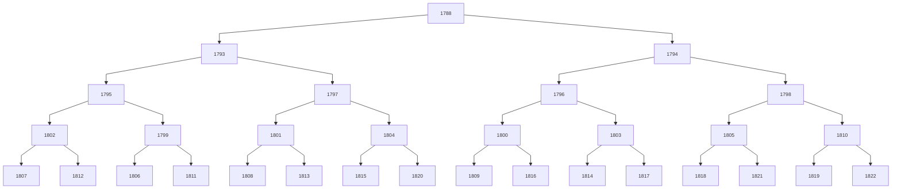
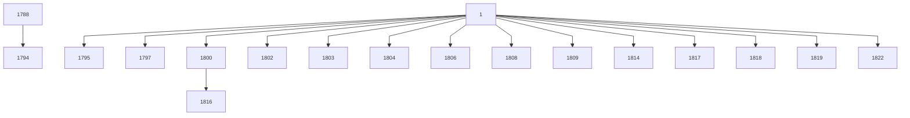
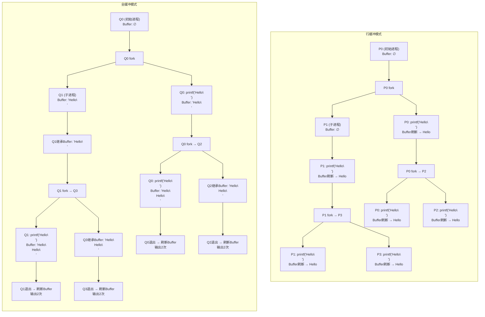

# 操作系统到底在管理什么
## 资源共享
- 时分复用：多个用户轮流使用同一个资源
- 空分复用：多个用户同时使用一个资源的一部分
## 发展
- 手工操作
	- 人机矛盾大：输入输出时间长
- 批处理：一次处理一批
	- 联机批处理
	- 脱机批处理：外围机完成输入输出的方式
- 分时操作系统
	- 多道程序运行：
	- 微观上串行
	- 多作业同时进行

### 调度
- 作业调度：从外存到内存
- 进程调度：分配资源
### 分时
- 多终端共享主机
- *时间片*轮转：及时处理 
- 先分配次要资源s
### 实时
及时响应操作指令
- 实时控制
- 实时信息处理
## 通用
- 批处理
- 分时
- 实时
满足三个中的多个就是通用操作系统

## 基本特征
### 并发
- 并发：多个任务同一时间进行
- 并行：多个任务前后进行
### 共享
资源可供多个并发的进程共同使用
- 互斥共享：一段时间只允许一个进程访问
- 同时访问：一段时间允许同时访问

### 虚拟
物理上的实体变为若干逻辑上的对应物。
*e.g. 分时技术、虚拟内存*

## 作用与功能
### 作用
- 接口
- 虚拟机
- 管理者
### 功能
#### 管理
1. **处理机管理**
- 进程控制：进程的创建、撤销
- 进程同步：并发的进程协调
- 进程通信：负责信息交换
- 调度： 作业调度和进程调度
	- 作业调度：从后备作业队列中按照一定规则选择进入内存
	- 进程调度：为作业分配CPU资源
	
2. **存储器管理**
- 内存分配
- 内存保护：*e.g. 上下界寄存器*
- 地址映射：虚地址映射到实地址
	- 逻辑地址： 相对地址、虚拟地址。用户编程时使用的地址
		- 地址空间：逻辑地址的集合
	- 物理地址：内存中的地址。实地址、绝对地址
		 - 内存空间：物理地址集合
- 内存扩充：请求调入或置换
3. **设备管理**
- 设备分配：根据I/O请求分配和回收设备
- 缓冲管理：对缓冲区管理。速度差异的处理*缓冲减少人机矛盾*
- 设备驱动：设备启动、I/O、中断处理
4. **设备独立性：设备无关性**
5. **文件管理**
- 文件储存空间管理
- 目录管理

#### 接口
互斥：资源
同步：依赖
##### 命令接口
- 脱机控制：系统控制
	- 脱机命令接口：用户将作业和操作说明一同提交。
- 联机控制：用户交互式控制
- 联机命令接口：*e.g. 键盘命令*
		- 内部命令：常驻内存，使用频繁
		- 外部命令：独立驻留硬盘
#### 系统调用
- 分类
	- 设备管理
	- 文件管理
	- 进程控制
	- 进程通信
	- 内存管理
- 过程
	- 保存现场
	- 执行
	- 恢复现场
***高级相对人而言，人看得懂的称为高级。所以用户态相交内核态更加高级。***

### 环境和内核结构
- 模块结构
- 层次结构
- 宏内核
- 微内核


操作系统给编程人员的接口是 *系统调用*

___
- 进程状态：运行时状态，操作系统还会保存一些只读的状态
	- 通过系统调用看到进程号
		- `getpid`
		- 父进程
	- 让ai生成一段程序，来获取当前的pid
```c
int main() {
	pid_t pid = getpid();
	pid_t ppid = getppid();
	uid_t uid = getuid();
	gid_t gid = getgid();
	printf("Process ID: %d\n", pid);
	printf("Parent Process ID: %d\n", ppid);
	printf("User ID: %d\n", uid);
	printf("Group ID: %d\n", gid);
	return 0;
}
```
- 递增的pid，共同的父进程
![[./img/操作系统到底在管理什么-01.png]]
- 共同的进程是shell
	- `ps ax | grep 19433`%%ps ax显示现在的运行的进程%%
	- 找到813是`  813 pts/3    Ss     0:00 /bin/bash --init-file /home/sda/.vscode-server/bin/ddc367ed5c8936efe395cffeec279b04ffd7db78/out/vs/workbench/contrib/terminal/common/scripts/s`
- 公理
	- ***机器永远是对的***
	- ***未测代码永远是错的***
	- c语言测试框架
- 进程管理api（创建和销毁）
	- windows：`CreateProcess`  类型+名称，类型变量定义更加不可读避免出错，匈牙利命名法

| 前缀   | 类型                         | 示例            | 说明            |
| ---- | -------------------------- | ------------- | ------------- |
| `b`  | `BOOL` / `BYTE`            | `bIsActive`   | 表示布尔变量        |
| `c`  | `char`                     | `cLetter`     | 单个字符          |
| `dw` | `DWORD` (32位整数)            | `dwProcessId` | 双字（32位无符号整数）  |
| `h`  | `HANDLE`                   | `hFile`       | 句柄（如窗口句柄）     |
| `l`  | `LONG`                     | `lHeight`     | 长整型           |
| `lp` | `LONG POINTER`             | `lpBuffer`    | 指针变量          |
| `n`  | `int`                      | `nCount`      | 一般整数          |
| `p`  | `pointer`                  | `pData`       | 指针            |
| `sz` | `String (zero-terminated)` | `szFileName`  | 以 `\0` 结尾的字符串 |
| `w`  | `WORD` (16位整数)             | `wVersion`    | 16位无符号整数      |
#### fork()
	- 立即复制状态机
	- 寄存器&每一个字节的内存，所有状态的拷贝。
	- 原状态机返回新建进程的pid，副本返回0（子进程返回0）在子进程中，
	- `pid == 0` 只是 `fork()` 的返回值，它并不代表进程的实际 PID。  
	- 子进程的实际 PID 由操作系统分配，通常是大于 **1** 的唯一正整数。
	- `man 2 fork`
- 进程树
	- A（121）->B（122）->C（123）->D（124）
	- 如果B、C退出了，那么D的ppid是多少？
	- 123？不正确，会被复用
	- 121，树形的删除会接上，往上提会发错人
	```c
	        if (WIFSIGNALED(status)) {
	            int sig = WTERMSIG(status);
	            switch (sig) {
	                case SIGALRM: msg = pcol("Timeout", 33); break;
	                case SIGABRT: msg = pcol("Assertion fail", 35); break;
	                case SIGSEGV: msg = pcol("Segmentation fault", 36); break;
	                default: msg = pcol(strsignal(sig), 31);
	            }
	```
	- 实际上子进程退出时要通知父进程，通过SIGCHILD
	- 真实的父进程可能会`waitpid()`等待子进程结束
		- 也可能没有调用，父进程先退出
		- 树形往上接上不对，不是真实的父进程
![[./img/操作系统到底在管理什么-02.jpg]]




```
@Galaxy pstree % ps ax  
PID TT STAT TIME COMMAND  
1 ?? Ss 0:23.87 /sbin/launchd
```
- 一号进程
- fork bomb核裂变进程分裂，系统爆炸 
- 考虑下面程序
```c
#include <stdio.h>
#include <unistd.h>
int main() {
    for (int i = 0; i < 2; i++) {
        fork();
        printf("Hello\n");
    }
    return 0;
}
```
print 打印的时候如果是管道，会等待再打印。如果是终端，会立即打印。实际行为是输出到buffer
```python 
        sys_fork()
        heap.buf += '⭐️'  # Actual behavior of printf()
```
 fork之前是把全局变量输入到buffer里面，fork的时候缓冲区同步复制，里面的东西的地址是一样的，所以输出的时候只能输出一个。

#### execve()
- **fork()只是复制当前程序，不能启动其他程序**
- ***复位状态机***: `execve`唯一能够“执行程序”的系统调用
	- 因此也是strace第一个系统调用
	- `int execve(const char *filename, char * const argv[], char * const envp[]);`
	- 将当前进程**重置**成一个可执行文件描述状态机的初始状态
	- execve之后的所有代码都不会被执行了
	- **操作系统维护的状态不变**：进程号、目录、打开的文件……
		- 内维护的指

| ​**复位（Reset）​** | ​**保留（Preserve）​**     |
| --------------- | ---------------------- |
| 代码、数据、堆栈        | PID、PPID               |
| 信号处理器           | 文件描述符（非 close-on-exec） |
| 环境变量（除非显式指定新的）  | 工作目录和根目录               |
| 寄存器状态（重置为新程序入口） | 用户/组 ID 和权限            |
| 内存映射和共享库        | 资源限制（如 `ulimit`）       |
- `execve`必须用绝对路径
- 环境变量
