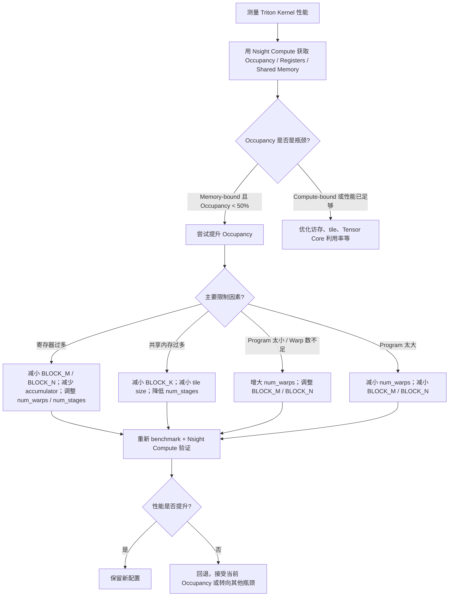

# IV.Occupancy与Scheduling

## 前置知识
这一个版面主要回答的问题是
***一个kernel的多个block是怎么在SM内和SM间怎么调度的；限制一个SM上同时执行多少个block的因素是哪三个？***
## 总流程
我觉得我还需要知道triton整体的这个发射到调度的流程是怎么样的，先前有一些把triton和cuda搞混了。
我目前的理解是：
1. launch一个kernel,使用`_matmul_kernel[grid](...)`启动一个grid,其中grid是
```python
grid = lambda meta: (triton.cdiv(m, meta["BLOCK_SIZE_M"]) * triton.cdiv(n, meta["BLOCK_SIZE_N"]),)
```
2. 这个grid实际代表的是很多个block合起来，grid对应的硬件是gpu,所以意思是这一句launch会在我们的一个gpu上执行，然后启动`M*N`这个形状个BLOCK（program）
3. BLOCK对应的硬件是SM，triton其实就是一个program进行计算，然后kernel内部使用pid来代表最小的执行单元thread. 所以pid是对应thread的进程号，然后这里pid是一个全局的编号，可以通过pid来判断当前的program负责整体矩阵计算的哪一块。
4. 实际调度是根据program来的，也就是pid代表的一个program会被调度到一个SM中驻留执行。真正被调度到 SM 上的是CUDA thread block也就是Triton program
5. 一个SM实际上可以容纳多个BLOCK同时驻留(resident)，一般发生在SM数量少于发射的BLOCK数量的情况下。SM中的每个 block 都会申请自己的一份 shared memory，会根据数据是否准备好进行调度.
6. triton上的一个 pid 就对应一个 Triton block/program，一个program负责计算的是一个`BLOCK_M*BLOCK_N`的大小，也就是上文提到的一个BLOCK的计算范围。
## Block调度

![[./img/III.Occupancy与Scheduling-01.png|800]]

一个SM可以容纳多个Block在其中驻留，然后SM内部根据warp为单位进行调度执行。一个SM中有多个warp可以轮换切着占用core。

限制的因素主要应该是：
- shared memory（共享内存）
- thread context（线程上下文）
- register file（寄存器文件）
- block size（块大小）

***线程上下文存在硬件维护的`register file + warp state hardware`中***，包括pc、寄存器、执行状态等，用于恢复上下文

***shared memory是block 内通信，tile中cache等***，不能block之间共享的信息。

***SM 的寄存器总量是固定的***，GPU 的 warp 切换不做寄存器swap，而是所有 resident warp 的寄存器状态一直保存在 SM 里，所以寄存器也是限制因素

***GPU 真正调度的单位是warp而不是block***，如果block切得太碎，使得block达到上限而warp数没有达到依然会造成浪费。

在 triton 里，warp 数是对应 program 的，编译器根据 `num_warps` 参数生成的。

```python
_matmul_kernel[grid](
    ...,
    BLOCK_SIZE_M=128,
    BLOCK_SIZE_N=128,
    num_warps=8,
)
```

除了 grid 中指定，`num_warps` 来源还可以是 autotune 的 config，也可能是在 kernel launch 时显式传入。

#### 为什么算子1的SM利用率低，算子1和算子3怎么共同运行
因为kernel单独launch一次，Triton/CUDA GEMM 通常按输出矩阵切 tile，算子1的低秩矩阵能够分块的tile不多，导致单次launch后空闲的SM太多。
算子1和算子3之间没有依赖。算子3不会占满所有资源。

# occupancy
[参考资料](https://caomaolufei.github.io/AIInfraGuide/guides/%E6%A8%A1%E5%9D%97%E4%BA%8C-cuda%E7%BC%96%E7%A8%8B%E4%B8%8E%E7%AE%97%E5%AD%90%E4%BC%98%E5%8C%96/23-occupancy%E4%B8%8E%E8%B5%84%E6%BA%90%E5%88%86%E9%85%8D/)
- ***正式定义***
$$
\text{Occupancy} = \frac{\text{每个 SM 上活跃 Warp 数}}{\text{每个 SM 支持的最大 Warp 数}}
$$
例如在 A100（Compute Capability 8.0）上：
- 每个 SM 最大支持 64 个 Warp（2048 个线程）
- 如果你的 Kernel 由于资源限制只能在每个 SM 上运行 32 个 Warp
- 那么 Occupancy = 32/64 = 50%

Occupancy 的核心价值在于**延迟隐藏**（Latency Hiding）。GPU 的执行模型依赖 Warp 切换来掩盖内存访问延迟：

```
时间线：
Warp 0: [计算] [等待内存...400cycles...] [计算]
Warp 1:        [计算] [等待内存...400cycles...] [计算]
Warp 2:               [计算] [等待内存...400cycles...]
...

如果活跃 Warp 足够多，调度器总能找到就绪的 Warp 来填充等待期
```
### wave
第1个wave就是前Sm数量乘x每个sm最大驻留的block数`wave = 一批同时 resident 的 blocks。`
比如一个GPU有80 SM，每个SM可驻留4个Block.那么first wave就是320BLOCK
等第1 wave有 block 结束，再补上后面的
很多 GPU（尤其 NVIDIA） 第1 wave通常会近似 round-robin。

```
block0 -> SM0
block1 -> SM1...
```
虽然官方不保证但实际经常这样。所以很多人利用这个“经验规律”做

```c
if (blockIdx.x < 40)   
     taskA();
 else  
     taskB();
```
试图taskA 用前40个SM，taskB 用后40个SM。
不过后续的waves可能就会打破这个规律。这时有一个做法是[persistent kernel](https://zhuanlan.zhihu.com/p/1974907485669320236)可以强制做这种复用
>[!example]-
>启动 NumBlocks ≈ NumSMs，例如 108 个 persistent blocks
>
>每个 block 根据自己的 block_id 被分到两个 worker pool：
>
>Pool 0: main workers，负责 W = X @ C 的 896 个 tile
>Pool 1: lora-down workers，负责 Y = X @ A 的 4 个 tile
>
>每个 worker 在 kernel 内部循环取 tile：
>```python
>  while true:
>      tile_id = atomic_add(global_counter, 1)
>      if tile_id >= total_tiles: break
>      compute tile
>```
>更好的设计是“两阶段 worker”：
>```python
>if block_id < num_down_workers:
>    先处理 down tiles: Y = X @ A
>    down tiles 做完后，转去处理 main tiles: W = X @ C
>else:
>    直接处理 main tiles: W = X @ C
>```

### 工具
 - Nsight Compute 中的 Occupancy 分析
```
# 关键指标
sm__warps_active.avg.pct_of_peak_sustained_active   # 实际活跃 Warp 占比
launch__occupancy                                    # 理论 Occupancy
launch__registers_per_thread                         # 每线程寄存器
launch__shared_mem_per_block_allocated               # 每 Block 共享内存
```
Nsight Compute 还会显示 Occupancy 的瓶颈来源：
```
Occupancy Limiters:
  Registers:        50%  ← 瓶颈
  Shared Memory:    75%
  Block Size:       100%
  Theoretical:      50%
```

### triton版调优流程

